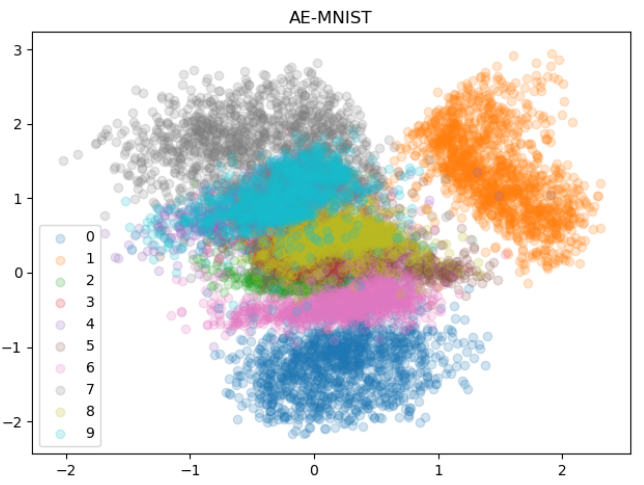
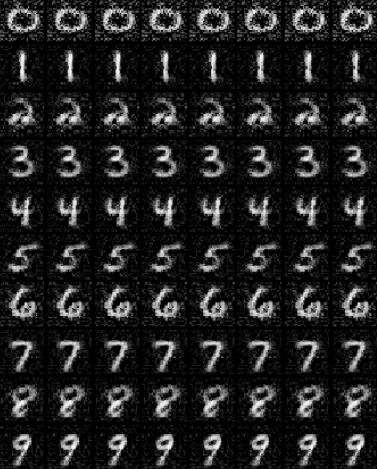
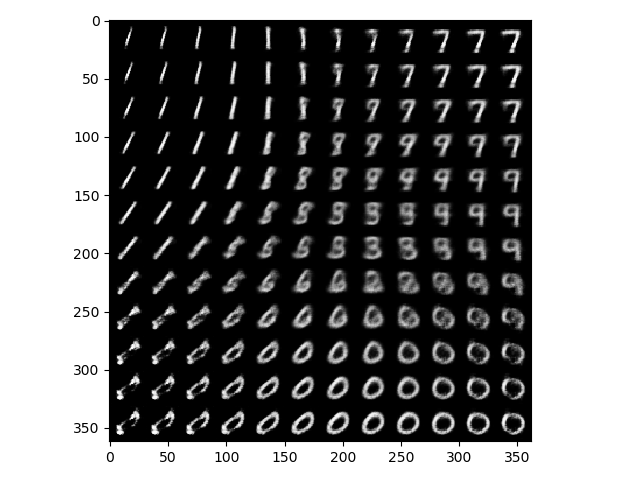
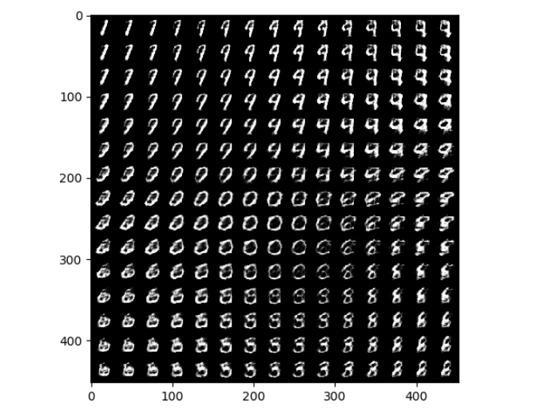

# CVAE-GAN-zoos-PyTorch-Beginner
首先先感谢给小透明点赞的几个朋友。

中文讲解：

如果你是第一次接触AE自编码器和GAN生成对抗网络，那这将会是一个非常有用且效率的学习资源。所有的内容使用PyTorch编写，编写格式清晰，非常适合PyTorch新手作为学习资源。本项目的所有模型目前都是基于MNIST数据库进行图片生成。MNIST数据集是一个比较小，一个光CPU就能跑起来的小数据库。新人友好数据库。

本项目总共包含以下模型：AE（自编码器）, DAE（降噪自编码器）, VAE（变分自编码器）, GAN（对抗生成网络）, CGAN（条件对抗生成网络）, DCGAN（深度卷积对抗生成网络）, WGAN（Wasserstain 对抗生成网络）, WGAN-GP（基于梯度惩罚的WGAN）, VAE-GAN（变分自编码对抗生成网络）, CVAE-GAN（条件变分自编码对抗生成网络）PS:部分英文翻译的中文是我自己编的，哈哈！

建议学习这些模型的顺序为：  
  

****

运行AE.py的时候，会自动在同目录下生成**data**文件，这个文件是自动下载的MNIST数据集；还会生成**img_AE**，这个是每一个epoch模型生成的图片

AE和DAE是非常类似的，这两个不是生成模型，而是单纯的对数据进行压缩存储的网络，不是生成网络!在运行完**AE.py**之后，会生成一个**AE_z2.pth**模型存储文件，之后可以运行**AE_test.py**，会生成网络对手写数字的压缩，可以看到相同数字映射到2维度的时候，会聚集在一起，有一点像是聚类分析。是一种无监督学习。来看一下AE的编码图像：

  

可以看到相同的数字彼此更靠近

  

这个就是把28\*28的手写数字映射x,y两个维度上，看一下x,y属于\[-2,2\]的这个正方形区域，分别对应哪些图片。这个图片有点那个味道，但是我们发现中心的数字更亮，那是因为这个网络只能编码，而不能生成，想看比较好的效果的可以直接去看CVAE-GAN生成的图片，很有feel，你也很快就能生成。

***

CGAN是conditional 虽然GAN是无监督学习，但是我们也可以加入标签信息，然后生成指定标签的图片：

  

***
VAE是AE模型家族中的一个生成模型，来看一下VAE生成的图像：

  

***
VAE-WGANGP是一个在本项目中效果最好的无需标签的无监督生成网络。图像清晰，而且过度均匀

  

***
CVAE-GAN是比较好的效果，

首先我们可以生成指定的不同样式的数字：

我们也可以观察一个数字是如何慢慢转化成另外一个数字的：

***
英文版本还没有写完2333
For beginner, this will be the best start for VAEs, GANs, and CVAE-GAN. 

This contains AE, DAE, VAE, GAN, CGAN, DCGAN, WGAN, WGAN-GP, VAE-GAN, CVAE-GAN. 
All use PyTorch.
All use MNIST dataset and you do not need download anything but this Github.

If you are new to GAN and AutoEncoder, I advice you can study these models in such a sequence.

1,GAN->DCGAN->WGAN->WGAN-GP

2,GAN->CGAN

3,AE->DAE->VAE

4 if you finish all above models, it time to study CVAE-GAN.

I have spent two days on rebuilding all these models using PyTorch and I believe you can do better and faster.

Let's see the results of CVAE-GAN:

you can generate any photos as you like

you can find out how a number change to a different one. It's interesting!

