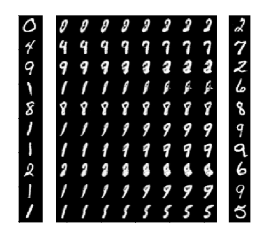

# CVAE-GAN-zoos-PyTorch-Beginner
如果你是第一次接触AE自编码器和GAN生成对抗网络，那这将会是一个非常有用且效率的学习资源。所有的内容使用PyTorch编写，编写格式清晰，非常适合PyTorch新手作为学习资源。

本项目总共包含以下模型：AE（自编码器）, DAE（降噪自编码器）, VAE（变分自编码器）, GAN（对抗生成网络）, CGAN（条件对抗生成网络）, DCGAN（深度卷积对抗生成网络）, WGAN（Wasserstain 对抗生成网络）, WGAN-GP（基于梯度惩罚的WGAN）, VAE-GAN（变分自编码对抗生成网络）, CVAE-GAN（条件变分自编码对抗生成网络）PS:部分英文翻译的中文是我自己编的，哈哈！

建议学习这些模型的顺序为：
For beginner, this will be the best start for VAEs, GANs, and CVAE-GAN. 

This contains AE, DAE, VAE, GAN, CGAN, DCGAN, WGAN, WGAN-GP, VAE-GAN, CVAE-GAN. 
All use PyTorch.
All use MNIST dataset and you do not need download anything but this Github.

If you are new to GAN and AutoEncoder, I advice you can study these models in such a sequence.

1,GAN->DCGAN->WGAN->WGAN-GP

2,GAN->CGAN

3,AE->DAE->VAE

4 if you finish all above models, it time to study CVAE-GAN.

I have spent two days on rebuilding all these models using PyTorch and I believe you can do better and faster.

Let's see the results of CVAE-GAN:

you can generate any photos as you like

you can find out how a number change to a different one. It's interesting!

